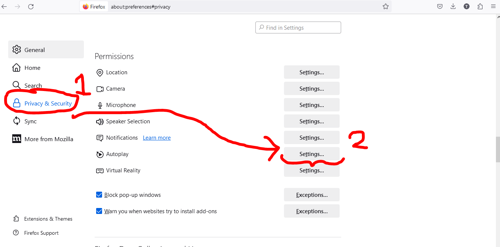

# Cleanphobia
github: https://github.com/thisisdaniel1/Cleanphobia

It's Daniel again!

Tools Used:
Phone (Android)(HTC u11 Life) to record

Clipchamp to edit clips. Usually to stretch and add audio into clips which I feel need more information.

VideoCandy's Reverse Video: https://videocandy.com/reverse-video.html
Used mostly because Clipchamp does not have a reverse video feature and VideoCandy offered a simply and watermark-free experience.

Paint.net to create the cursors (eyes & arrows), buttons, and other images.

HTML is used to display the videos, images, and other HTML tags.
CSS is used for background, image, and other stylings. It's how all the images are centered and decides which colors go where.
JS is used to create buttons, to detect and remove the highlighted objects, and play audio.

Setup Intructions

A core part of this game is for videos to autoplay in the web browser.
To this, you have to enable autoplay global permissions.

Unfortunately, from my experience Chrome does not allow for autoplay to be automatic and this game was intended for Firebox. So I would recommend using Firebox although any browser that supports video with an automatic autoplay setting should work.

Firefox
First click on the three gray bars in the top right corner then click on Settings.

Then scroll down to Privacy & Security and click for more under Autoplay

Once in, select Allow Audio and Video. Remember to disable these permissions after playing if you do not want videos to autoplay.

Then once you've set up autoplay, double click or open index.html to start!

This game was not designed with fullscreen in mind so do not go fullscreen with F11.

Welcome to Cleanphobia!

Cleanphobia is a point and click puzzle game with fmv (Full Motion Video) elements.
In this game, the player wakes up in a locked shower and have to assemble a keypad code to escape.
The code will be digits between 0-9 and these digits will be hidden behind various riddles,
all of which the player will discover as they click away.

Goal of the game is to escape the shower/bathtub and to not lose. Also in case you missed it, the opening cutscene has the player character saying you cannot climb over the door.

Controls:

Left-Click                                   Select
Hold e to highlight selectable objects       E (or e)

Blue outlines are objects you can view closer or observe from afar
Red outlines are directions you can move in
Yellow outlines are objective objects that you interact with to progress through the game (theres not many of these)

Walkthrough is at the end of the readme. I only recommend reading it if you're struggling.

Other technical details about the game:

Also the game is made in html and intended to be opened in File protocol, however most of the functionality
will be derived from a DOM JS system and depend greatly on my CSS abilities (of which I have none).

Each scene is stored as an html and is associated with the transition clip from the scene the player was on previously to the scene the player will be going to. 

So clicking the "right" option from the "start" scene will navigate to the start-right html where the transition clip is start-right.mp4 and the ending buttons will be associated to that of the ending scene, in this case "right".

Unfortunately, this system requires an html for each transition which means that this three room game has needed six transitions just for navigating between them. This is not even considering the minor transitions between objects like the bookmark or end and start states.

To alleviate the need for htmls, I have used some audio clips to describe the interaction between certain minor objects like the cards.

Filming:

When embarking on this project, I never even considered how much time it would take to film, edit, or even for reshoots. To give you an idea of what I had to go through, I learned (or re-learned in some cases) how to add hyperlinks and videos to an html file over the weekend, then, after work and classes, spent Monday planning the transition clips I would need, and ONLY then could I start filming. But over the course of 30 minutes, it took me 15 minutes to create the props I used for the video (only some of which made it into the final film) and ANOTHER 15 minutes to film the scenes.

And even after I thought I finished filming, when putting the actual scenes together into a story I quickly found that I forgot to record crucial scenes or that those scenes were in such poor quality that I had to edit additional audio to compensate. While I could schedule reshoots, it's not like the bathtub is a film set that's waiting for me, there are several items I have to clear and set up every time, and sometimes it wouldn't be completely dry.

I knew that the project would require some filming but could never have imagined it being this hard and really shows you how this project is not just the programming of the game but also the filming of a story.

Editing:

Just a quick note, I suspect the reason why the videos would sometimes buffer is because videos recorded by phone are naturally too high quality for html to render well. I "think" I have solved this by converting all the clips into 720p using Clipchamp but have not tested it much. One thing I will say though is that this change has greatly reduced the size of some clips, sometimes up to half.

Of course this does not exactly account for why I am able to run everything at my home but I hope the conversion helps with the issue.

Also note that there is only one start html which means I can have a unique keypad transition that can play when the player first looks at the keypad. Yes I am aware that this transition only plays from the start html and not the other htmls that have start as its endpoint.

CSS & JS:

One interesting feature in this game is its use of unique css and javascript for each html. Usually, I have one main css and javascript, and have my many htmls reference only one or two styles/events.

However, because I cannot store data easily and then pass that into a function or have specifically selected absolute positioning for my buttons, I would need specially crafted styling or functions for each of the many buttons. This is even worse when you consider how inconsitent some of the ending shots are, like in one ending shot a card might be higher up and in another ending shot over the same section could have that card lower down.

Needless to say, all the specificty between the transitions and inconsistency between shots means the master css or javascript file would have to be very long and repetitive for each of the many or similar buttons.

One thing I will say though, is that I could and should stil have a single css file for all the border positioning and other general border details. Then for the more specific aspects like the cursor type and border color, I can append that to the general styling with inline styling. Considering all the htmls that have copied the same general border styles, I could have reduced on the copying. Also I could have had global boolean values to check whether the player has seen that html before or not to play unique videos for when the player first sees the object.

One feature I am proud of is that the "e" button which highlights all the items you can select. It uses a combination of JS to detect when the "e" key is pushed down and when it is released; and of CSS to enable it to be pressed using the visibility property and the opactiy property to make it invisible.

Also I struggled a lot of css during this project and here are some of the w3, freecodecamp, or more sources I used:
Notice how I do not copy from some larger project, I instead use lots of snippets about properties or objects that I don't know about.

For the "taped" img on the start screen, the one with tape over my mouth, I turned the image tag into a block type which I was then able to resize to fit within an alotted block. Also 
https://www.freecodecamp.org/news/how-to-center-an-image-in-css/

For the input tag used on the keypad, I used this: https://developer.mozilla.org/en-US/docs/Web/HTML/Element/input/text. Not much to it other than that it holds a string with a max length of 4, in other words 4 digits, which I then compare to the accepted string of "1400". 

https://stackoverflow.com/questions/13952686/how-to-make-html-input-tag-only-accept-numerical-values
The reason why I went with the type of text instead of number is because I'm not a fan of the up or down arrows associated with it.

https://stackoverflow.com/questions/1351966/is-there-a-pure-css-way-to-make-an-input-transparent
This is related to the last entry but I wanted the player to be able to permanently type into the input box once the video has played which meant I needed the border of the box to be seen but have the background transparent.

https://cssreference.io/property/background-position/
I found this post to be the most informative in specifically centering a background image within a larger div. This is how I got the arrows or eyes to be centered within the boxes with the hyperlinks.

Now for some JS fixes:

https://www.w3schools.com/howto/howto_js_redirect_webpage.asp
Imagine JS hyperlinks. Exactly what this is and is used to send the player to the win/lose pages

https://www.w3schools.com/js/js_htmldom_html.asp
Kind of embarassing but I forgot how to change the innerHTML from web dev so I looked it up here. Used for the warning messages in the tutorial.

I'm pretty sure all the digital content (cursors, images, buttons) were created by me. I cannot say as to who created the physical props though.

Walkthrough:

To solve the four digit code you need to count the number of BLACK cards in this order: spades | clubs | diamonds | hearts while also taking into account that any pairing of two cards won't count. Also that the sum of the code is 5 in total.

These clues are from:
1. The yellow sticky note on the keypad which have those icons written in black to indicate that only black cards will count. Also the order of spades | clubs | diamonds | hearts. So if you can only find 2 black hearts and 1 black spade than the code is 1002.

2. On the surface, the bookmark at the start tells you that "A good book is a good friend." and that the sum of the code is 5. But you may have missed the two clubs at the end of the bookmark. These clubs are black and therefore qualify for the code and while they may be a pair I would consider the good book comment to supercede that of the fortune.

3. The right side has the fortune which warns the player NOT to consider pairs (don't fall one at a time) and:
        1 black 2 of spades
        1 black 4 of clubs
        1 red 6 of diamonds
Of which only the spades and clubs count towards the code.

4. The left side has 1 black 6 of clubs and a box. The box has two aces which are disqualified since they are a pair.

So in total 1 black spade and 4 black clubs which make a code of 1400.

Also quick note, the tutorial's main differences are that it nudges the player into having a look at the keypad first and once there, to try the submit button once before being able to leave.

The buttons pushed forward by the tutorial are highlighted in yellow and on the starting screen can be avoided at the cost of ending the tutorial early.

The tutorial is intended to push new players in the right direction by directing them to look at the keypad and most importantly the submit button first.